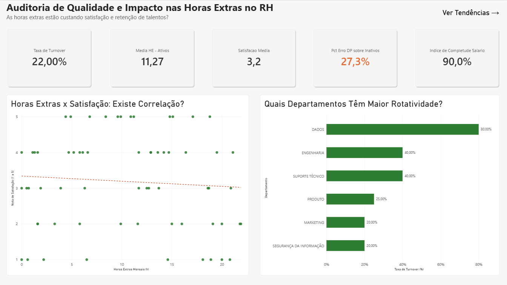
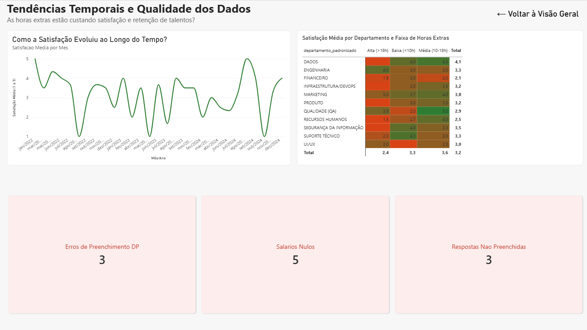

# 🔍 Auditoria de Dados de RH: Turnover, Horas Extras e Falhas de Integração

> Auditoria e limpeza de dados de RH que cruzou sistemas desconexos para revelar a causa raiz do turnover em uma empresa de tecnologia.

---

## 📌 Resumo Executivo

Este projeto realiza uma **auditoria completa na qualidade dos dados** do setor de Recursos Humanos de uma empresa de tecnologia. O objetivo foi limpar, cruzar e analisar bases de dados desconexas — o **Sistema de Departamento Pessoal** e a **Plataforma de Pesquisa de Clima** — para identificar as causas por trás da baixa retenção de talentos.

A análise revelou que o departamento de **Dados** apresenta a taxa de turnover mais crítica da empresa (80%), seguido por **Engenharia** e **Suporte Técnico** (40% cada), com uma correlação negativa entre volume de horas extras e satisfação dos colaboradores — além de falhas sistêmicas de preenchimento no Departamento Pessoal.

---

## 🏢 O Problema de Negócio

A empresa enfrentava dificuldades para entender os motivos da alta rotatividade de funcionários (*turnover*). A raiz do problema era técnica e sistêmica: o sistema do Departamento Pessoal não possuía integração com a nova plataforma de Engajamento, o que gerava dados órfãos, registros de demissão inconsistentes e notas de satisfação fora da escala permitida.

**Como Analista de Dados, minha missão foi:**

- ✅ Identificar e auditar as falhas de integração entre os sistemas
- ✅ Realizar a limpeza e padronização dos dados brutos (*Data Cleaning*)
- ✅ Gerar insights cruzando horas extras, satisfação e retenção por departamento
- ✅ Consolidar os achados em um dashboard interativo para tomada de decisão executiva

---

## 🛠️ Tecnologias e Técnicas Utilizadas

**Banco de Dados:** MySQL (DBeaver)

**Técnicas de SQL:** `LEFT JOIN` · `INNER JOIN` · `CASE WHEN` · `CAST` / `NULLIF` · Funções de agregação (`AVG`, `SUM`, `COUNT`) · Limpeza de strings (`TRIM`, `UPPER`)

**Visualização:** Power BI (DAX, Power Query, Modelagem de Dados Relacional)

### 📁 Estrutura de Arquivos

| Arquivo/Pasta | Descrição |
| --- | --- |
| `01_setup_database.sql` | Criação do banco de dados e das tabelas raw |
| `02_data_cleaning.sql` | Consultas de auditoria para identificar erros lógicos, valores nulos e chaves órfãs |
| `03_data_cleaning.sql` | Transformação dos dados brutos, padronização de nomenclatura e criação das tabelas limpas (`_clean`) |
| `04_business_analysis.sql` | Extração de métricas de negócio, avaliando o impacto das horas extras na retenção e satisfação por departamento |
| `dashboard/HR_Analytics_Dashboard.pbix` | Dashboard interativo em Power BI com todas as análises consolidadas |
| `images/` | Capturas de tela do dashboard |
| `engajamento.csv` / `funcionarios.csv` | Bases de dados tratadas utilizadas na análise |

---

## 📊 Dashboard Interativo (Power BI)

O projeto foi consolidado em um dashboard de 2 páginas, permitindo exploração interativa dos dados:

**Página 1 — Visão Geral:** KPIs executivos (Turnover, Horas Extras, Satisfação, Erro de Preenchimento DP), gráfico de dispersão Horas Extras x Satisfação, e Turnover por Departamento.

**Página 2 — Tendências e Auditoria:** Evolução da satisfação ao longo do tempo, matriz de calor cruzando Departamento x Faixa de Horas Extras, e indicadores de qualidade de dados.

---

## 📈 Principais Descobertas

Após o tratamento dos dados e o cruzamento das informações de horas trabalhadas com as pesquisas de engajamento, foram identificados os seguintes padrões:

**🔸 Inconsistência sistêmica no DP**
27,3% dos funcionários inativos constavam sem data de demissão registrada (marcados como "Dado Ausente - Erro DP"), distorcendo os relatórios de headcount ativo da empresa.

**🔸 Turnover concentrado em áreas técnicas**
O departamento de **Dados** apresentou a taxa de turnover mais crítica da empresa (80%), seguido por **Engenharia** e **Suporte Técnico** (40% cada) — muito acima da média geral de 22%.

**🔸 Correlação entre horas extras e satisfação**
A análise de dispersão entre horas extras mensais e nota de satisfação revelou uma tendência de correlação negativa: funcionários com maior carga de horas extras tendem a reportar notas de satisfação mais baixas.

**🔸 Lacunas de preenchimento no cadastro**
10% dos registros de salário estavam nulos, e parte das respostas de satisfação da pesquisa de clima ficou em branco — reforçando a necessidade de validação obrigatória nos formulários de origem.

---

## 💡 Recomendações Estratégicas

Com base nos dados estruturados, seguem as ações recomendadas à diretoria:

1. **Investigação prioritária no time de Dados**
   O departamento de Dados apresenta a taxa de turnover mais alta da empresa (80%). Recomenda-se uma pesquisa de saída (exit interview) estruturada com os últimos desligados desse time para identificar causas específicas (carga de trabalho, remuneração, gestão).

2. **Redução de horas extras nas áreas técnicas**
   Dados, Engenharia e Suporte Técnico concentram as maiores taxas de turnover e também aparecem entre os grupos com mais horas extras. Recomenda-se revisar o dimensionamento de equipe e a distribuição de demandas nessas áreas.

3. **Automação no Departamento Pessoal**
   O alto índice de registros com erro de preenchimento (27,3% dos desligamentos sem data) indica falha de processo, não apenas erro humano pontual. É recomendável implementar validação obrigatória de campos no sistema de desligamento.

4. **Auditoria contínua na origem**
   Implementar uma trava no formulário de engajamento para aceitar estritamente valores numéricos entre 1 e 5, prevenindo a entrada de dados sujos desde a origem.

---

Projeto desenvolvido como parte do portfólio de Análise de Dados
